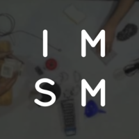

# {Sound Music Movement} Interaction Team

The ISMM Team of STMS-Lab (IRCAM - CNRS  - Sorbonne Université) conducts research and development on interactive music systems, including gesture and movement interaction, collective interaction and distributed sound systems, and interactive sound synthesis.

The applications focuses on primarly on music, performing arts and sound installation, but also reachs domain such as pedagogy and music education, sound design, to emerging applications such rehabilitation with auditory feedback.

> @ STMS-Lab IRCAM - CNRS  - Sorbonne Université
