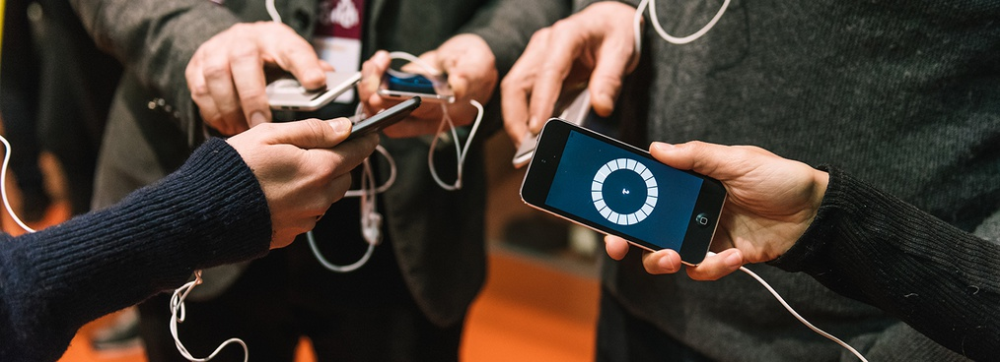

# {Sound Music Movement} Interaction Team

Welcome our developement documentations pages. 

The ISMM Team (IRCAM - CNRS  - Sorbonne Université) conducts research and development on interactive music systems, including gesture and movement interaction, collective interaction and distributed sound systems, and interactive sound synthesis.

The applications focuses on primarly on music, performing arts and sound installation, but also reachs domain such as pedagogy and music education, sound design, to emerging applications such rehabilitation with auditory feedback.

We are currently developing tools and applications for Max/MSP and in Javascript.

Our most recent open-source projects can be found at
- [ircam-ismm@github](https://github.com/ircam-ismm) 
- [Ircam Forum](https://forum.ircam.fr/projects/detail/mubu/)

> @ STMS-Lab  IRCAM - CNRS  - Sorbonne Université
