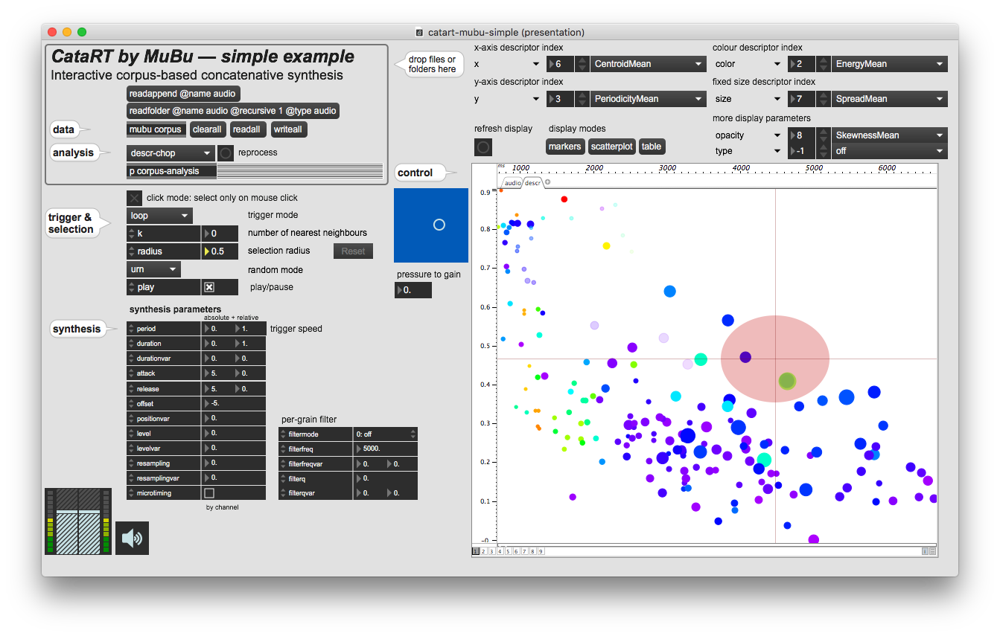
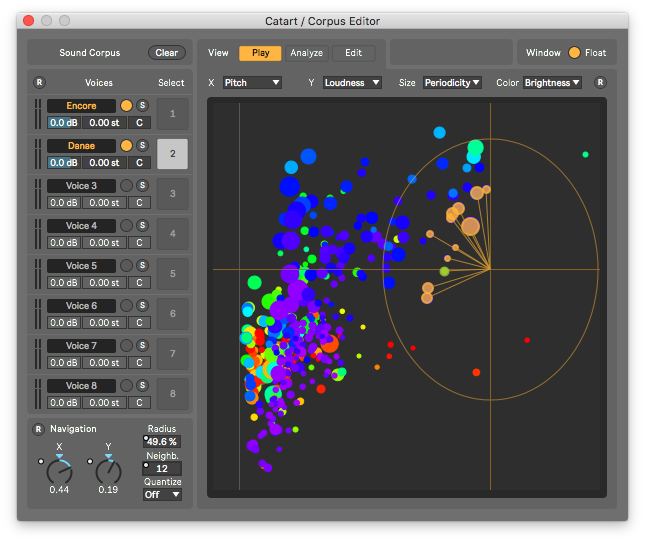
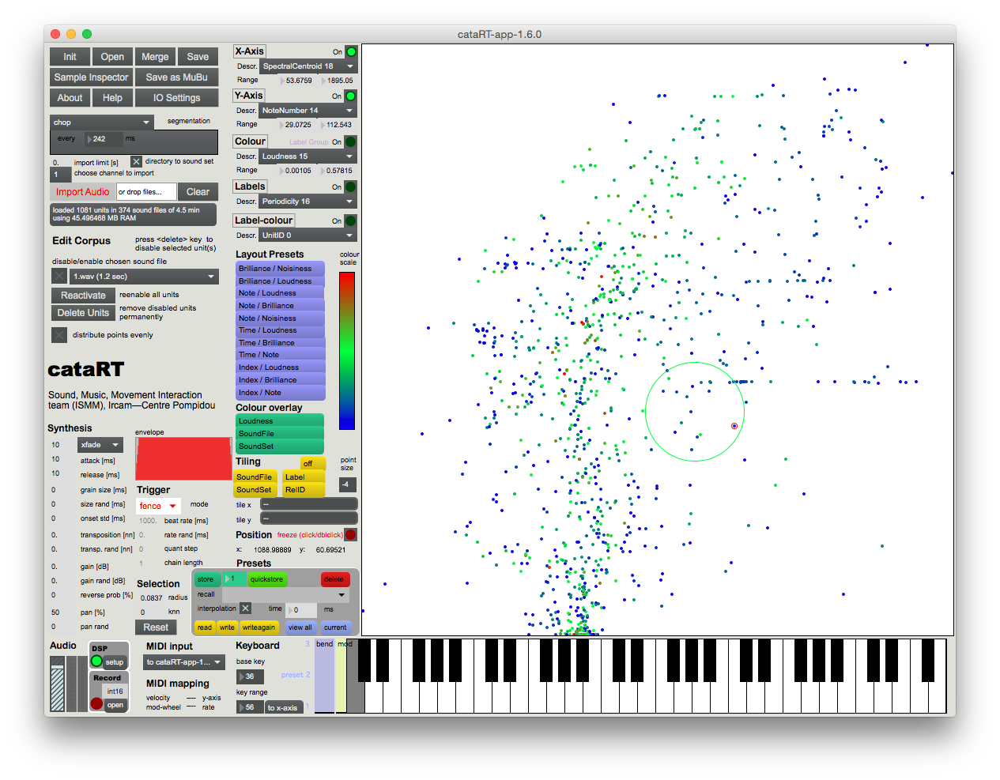

# CataRT

[[toc]]

The concatenative real-time sound synthesis system <strong>CataRT</strong>, created in 2005, plays grains from a large corpus of segmented and descriptor-analysed sounds according to proximity to a target position in the descriptor space. This can be seen as a content-based extension to granular synthesis providing direct access to specific sound characteristics.

For instance, this allows to create ***expressive textural evolution*** using perceptual timbre descriptors, control of output grains by similarity to audio input (***audio mosaicing*** or beat replacement), or juxtaposition of sounds from varying sources by timbral features.

The current CataRT comes in three flavours:

<table>
<td width=25% valign=middle>

</td>

<td width=25% min-width=60px valign=middle>
<em><a href="https://forum.ircam.fr/projects/detail/catart-mubu/">CataRT-MuBu</a></em>
</td>

<td width=50% valign=middle  min-width=60px>
patches for Max using objects from the <a title="MuBu" href="https://forum.ircam.fr/projects/detail/mubu/">MuBu library</a>, and descriptor analysis via the <a title="PiPo" href="https://github.com/ircam-ismm/pipo/">PiPo framework</a>
</td>
</tr>

<tr>
<td>

</td>

<td>
<em><a href="https://forum.ircam.fr/projects/detail/skatart/">SKataRT</a></em>
</td>

<td>
Max4Live device for <em>Ableton Live</em>, on the Ircam Forum (Mac/Windows).
</td> 
</tr>

<tr>
<td>

</td>

<td>
<em><a href="https://forum.ircam.fr/projects/detail/catart-standalone/">CataRT Standalone Application</a></em>
</td>

<td>distributed by the Ircam Forum (Mac Intel)
</td>
</tr>
</table>

Of historical interest is the original [<em>CataRT classic</em>](http://imtr.ircam.fr/imtr/CataRT) from 2005, a modular patch system for Max/MSP with the <a title="FTM&amp;Co" href="https://forum.ircam.fr/projects/detail/ftm/">FTM&amp;Co. extensions</a> (Mac/Windows, see also [ftm.ircam.fr](http://ftm.ircam.fr))

## Videos

This video from 2010 shows how various sounds (train and voice recordings) are imported and browsed by timbre in [<em>CataRT classic</em>](http://imtr.ircam.fr/imtr/CataRT):
<iframe width="640" height="480" src="https://www.youtube.com/embed/cWXdTlu_n44" title="YouTube video player" frameborder="0" allow="accelerometer; autoplay; clipboard-write; encrypted-media; gyroscope; picture-in-picture" allowfullscreen></iframe>

Here, several recordings of wind are used in the
<em>[CataRT Standalone](https://forum.ircam.fr/projects/detail/catart-standalone/)</em>
to recreate the temporal evolution of wind with varying strength and
character (gusts):
<iframe title="vimeo-player" src="https://player.vimeo.com/video/26838986" width="640" height="480" frameborder="0" allowfullscreen></iframe>

## Support and Community

Discussions about features and issues takes place on the [Forum discussion groups](https://discussion.forum.ircam.fr/categories), accessible from the respective [CataRT Forum projects](https://forum.ircam.fr/topics/detail/60-Catart/).

## See Also
<ul>
 	<li><a href="http://imtr.ircam.fr/imtr/CataRT_Instrument" target="_blank" rel="noopener noreferrer">CataRT as an expressive performance instrument</a>, collection of audio and video examples</li>
 	<li><a href="http://imtr.ircam.fr/imtr/CataRT_Music" target="_blank" rel="noopener noreferrer">Music and installations made with CataRT</a></li>
 	<li><a href="http://imtr.ircam.fr/imtr/Corpus-Based_Sound_Synthesis_Survey" target="_blank" rel="noopener noreferrer">Corpus-Based Sound Synthesis Survey</a>, ongoing web and literature study of approaches and advances in the field of CBCS</li>
</ul>
