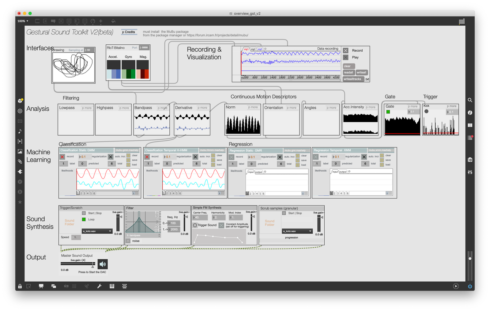
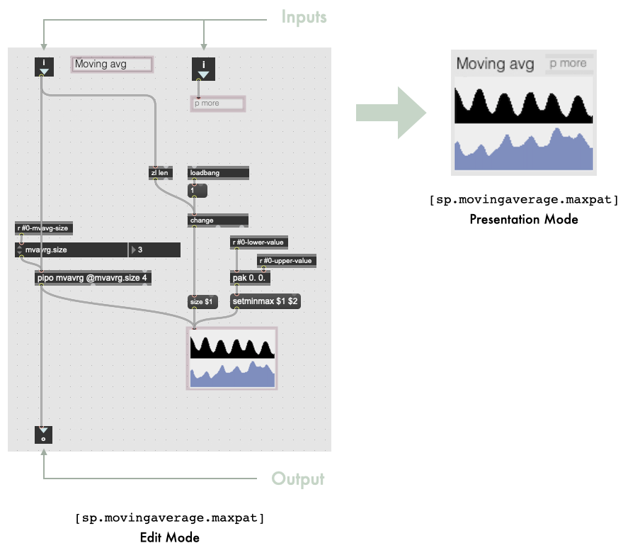

# Gestural Sound Tookit

The  [Gestural Sound Toolit](https://github.com/ircam-ismm/Gestural-Sound-Toolkit) using the package `MuBu` (available from the Cylcling'74 packages), is a set of object to facilitate sensor processing, gesture recognition, and mapping to sound engines.

- Available at [Gestural-Sound-Toolkit@github](https://github.com/ircam-ismm/Gestural-Sound-Toolkit)
- [Tech Report](hhttps://nubo.ircam.fr/index.php/apps/files/?dir=/public_shares_fb&fileid=10684307)

GST is designed to build gestural interactions with sounds, using ML methods for gesture recognition, gesture following, or gesture-sound mapping among other applications. The toolkit is built on the notion of high-level modules handling specific operations. The toolkit is comprised of four types of modules:

- Receiver modules receive motion data from the sensing hardware. In the interface, a module for R-IoT and bitalino is presented. Other modules exist to get data from the Leapmotion, the Myo, or generic OSC input streams. 

- Preprocessing and Analysis modules analyze and process gesture data. A Filter module can be used to reduce noise. The Energy module extracts gestural energy from the incoming signal. Velocity is calculated by computing the derivative. Some modules are specific to inertial sensors, as the most used hardware in our work with the toolkit.

- Machine Learning modules perform gesture recognition and regression. Classification can be static (for posture recognition) or temporal (for gesture following and real-time time warping). Similarly, regression can be static or temporal.

- Synthesis modules allow prerecorded sounds to be played and manipulated. The toolkit integrates temporal modulation (scrubbing). A trigger module allows for triggering a sound from a sound bank. A manipulation module allows sound to be sculpted and modified live as movement is performed.

> Module Design

As an example, the figure bewlo depicts the moving average module, called [sp.movingaverage.maxpat]. On the left, the patcher is shown in edit (or implementation) mode. It has two inputs and one output. In between, the patcher implements a moving average filter using some components from the MuBu library. Elements of the patch highlighted in pink are the ones remaining in the interface, depicted on the right of the Figure. The patcher opens in presentation mode by default (right of Figure below). Each module is independent from other modules. Therefore, extending the toolkit is made easy. One can create an arbitrary patchers and can follow the guidelines for its look in presentation mode, which defines its interface.

[[toc]]

Typical use cases

> Use case 1: Pedagogical tool for gestural sound interaction 

Ihe toolkit has been used yearly in a
pedagogical context. We describe this context and report observations made on
the impact of the design.

We used the GST in the context of a course on designing gesture-based interac-
tions with sounds. The course was part of a one-year curriculum on movement
computing using machine learning and artificial intelligence. The course was
given to young professionals who chose to dedicate one year to follow this cur-
riculum in order to acquire skills in movement computing. Although our class
was not specifically about ML, designing gesture-based interaction can involve
gesture recognition, or gesture-to-sound regression. The pedagogical objectives
were:
- Teaching basis in movement control and learning, especially in continuous
vs discrete actions, feedback and feedforward mechanisms in motor control,
and the law of practice.
- Exploring parametric sound synthesis, which includes a quick overview of
sound synthesis and specific focus on granular and concatenative synthesis
applied to recorded sounds.
- Understanding gesture-sound interaction, which includes interaction design
methodology, the notion of mappings and its design.
- Creating and implementing an interactive scenario, which involves the
development of such scenario, motivating design choices, and showing a
working prototype at the end of the course.

> Use case 2: Research through design - rapid prototyping

Building a tool that can be used by designers

GST was initially developed as part of a research project in 2013. In this project
we were organising workshops with designers in which they were guided in the
design of embodied interaction with sounds. The detailed of these workshops
can be found in [Carmiaux et al 2015]{https://research.gold.ac.uk/id/eprint/11418/1/caramiaux2015form.pdf}. In this series of workshops, we developed a
specific methodology where participants were guided through the design and
the implementation of an interactive scenario involving gesture control of sound
synthesis. In the methodology, participants were invited to start from the sound
(the feedback), as opposed to start from the gesture (the input). The motivation
behind this choice is to allow designers to be led by sonic affordances, that is to
say the way sounds may involve associated actions and body movements, in
the design of the interactive scenario. This was the ideation phase, which was
followed by a realization phase where participants used the GST to implement
their scenarios, after a quick tutorial to help them handle the tool.
The motivation behind the design of the toolkit was to provide designers with a
tool that allows them to realize their own, some unrealistic, project involving
gesture-based interaction with sound. Our objective was to build a tool that
6
includes designers with no programming experience, while enabling versatility,
which means that designers have to not feel limited in the scope of projects they
would like to develop

## Credits
> V1 Contributors:

AVI Group Goldsmiths College (Baptiste Caramiaux, Alessandro Altavilla)

IRCAM-Centre Pompidou (Mubu: Riccardo Borghesi, Diemo Schwarz, Norbert Schnell, Frédéric Bevilacqua, Jules Françoise) 

EAVI website: eavi.goldsmithsdigital.com, (c) 2015 EAVI Group, Goldsmiths College, University of London

> V2 Contributors:

STMS Lab IRCAM CNRS Sorbonne Université (Frédéric Bevilacqua, Riccardo Borghesi, Diemo Schwarz, Victor Paredes)

ISIR Sorbonne Université (Baptiste Caramiaux)

LIMSI CNRS (Jules Françoise)

