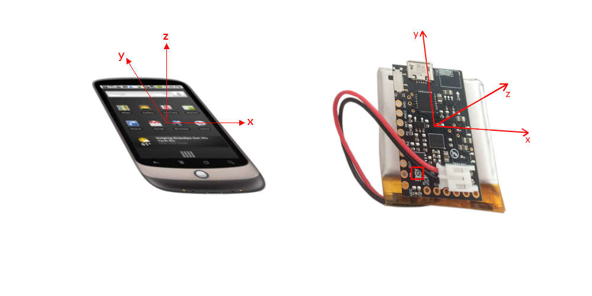

# R-IoT compatibility with W3C `devicemotion` specification

The aim of this document is to describe a convention to normalize data provided by the R-IoT motion sensor to match the W3C [devicemotion API](https://www.w3.org/TR/orientation-event/).

[[toc]]

## Goal

### Smartphone and R-IoT axes



### Units

|                 | Smartphone  | R-IoT   |
|       :-:       |     :-:     |   :-:   |
| Accelerometer   |     m/s2    |    g    |
| Gyroscope       |     °/s     |   °/ms  |

### Mapping function

To follow the `devicemotion` specification, the R-IoT's original acceleration and gyroscope data must be changed as follows:

``` js
const tmp_x = x;

// Acceleration : from g to m/s2 --> multiply by 9.81
x = 9.81 * y;
y = -9.81 * tmp_x;
z = 9.81 * z;

const tmp_alpha = alpha;

// Rotation : from °/ms to °/s --> multiply by 1000
alpha = 1000 * gamma;
beta = 1000 * beta;
gamma = -1000 * tmp_alpha;

```


## Smartphone's motion formats

> Smartphone's precise specifications can be found here : [https://www.w3.org/TR/orientation-event/#introduction](https://www.w3.org/TR/orientation-event/#introduction).

From the *deviceMotionEvent* , we can get the **accelerationIncludingGravity** and **rotationRate**.
The axes are set such as, with the phone held on the vertical, screen side up, x and y axis are both in the same plane, the first going towards the right, and the latter going up, and the z axis perpendicular to the screen.

![alt text][smartphone-axes]

The **accelerationIncludingGravity** return 3 floats, one for each axis, and is expressed in m/s2.
For example, if the phone is sitting flat on a table, screen side up, the acceleration would be [0, 0, 9.81].

As for the **rotationRate**, it returns 3 floats for each angular velocity, in °/sec.
The variable **alpha** represents the rotation angle around the the z axis,

![alt text][alpha-rotation]

**beta** around the x axis,

![alt text][beta-rotation]

and **gamma** around the y axis.

![alt text][gamma-rotation]

## R-IoT

> See the R-IoT manual : [https://bitalino.com/docs/MANUAL_RIOT_V1.2.pdf](https://bitalino.com/docs/MANUAL_RIOT_V1.2.pdf).

By default, the acceleration and rotation data from the R-IoT ranges between -1 and 1, expressed in m/s2 and °/ms, respectively.

As for the axes, by default they are as follows :

![alt text][riot-default]

However, we decided that we would change the axes so that the R-IoT indication on the sensor is legible.
The axes thus need to be changed from this :
![alt text][riot-wrong]

to this :

![alt text][riot-normalized]

As for the angles, gamma is the angle around the z axis, beta around the x axis, and alpha around the y axis.


[smartphone-axes]: ./images-riot/start.png "smartphone axes"
[alpha-rotation]: ./images-riot/alpha-rotation.png "alpha rotation"
[beta-rotation]: ./images-riot/beta-rotation.png "beta rotation"
[gamma-rotation]: ./images-riot/gamma-rotation.png "gamma-rotation"
[riot-default]: ./images-riot/riot-3d.png "riot default axes"
[riot-normalized]: ./images-riot/riot-normalized.png "riot normalized"
[riot-wrong]: ./images-riot/riot-wrong.png "png wrong axes"
[phone-alone]: ./images-riot/phone-alone.png "smartphone motion axes"
[side-by-side]: ./images-riot/side-by-side.png "smartphone and riot axes"

