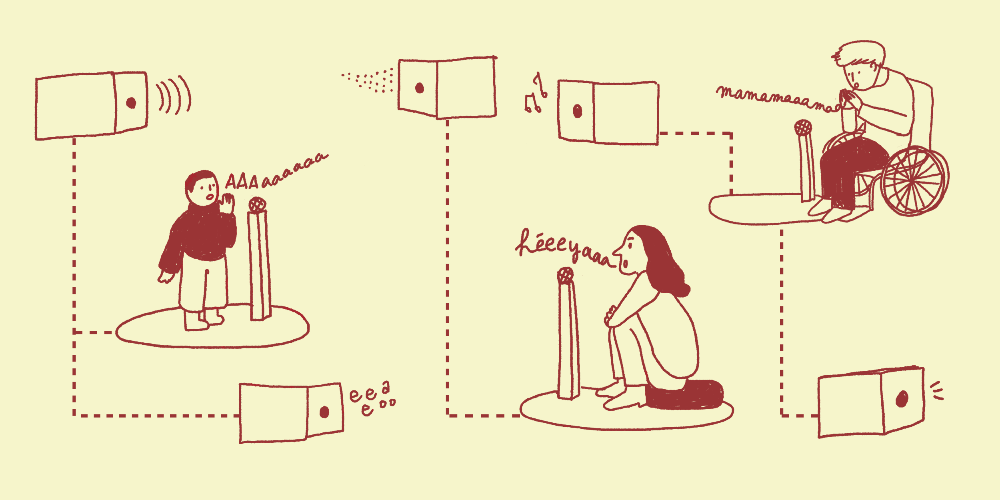
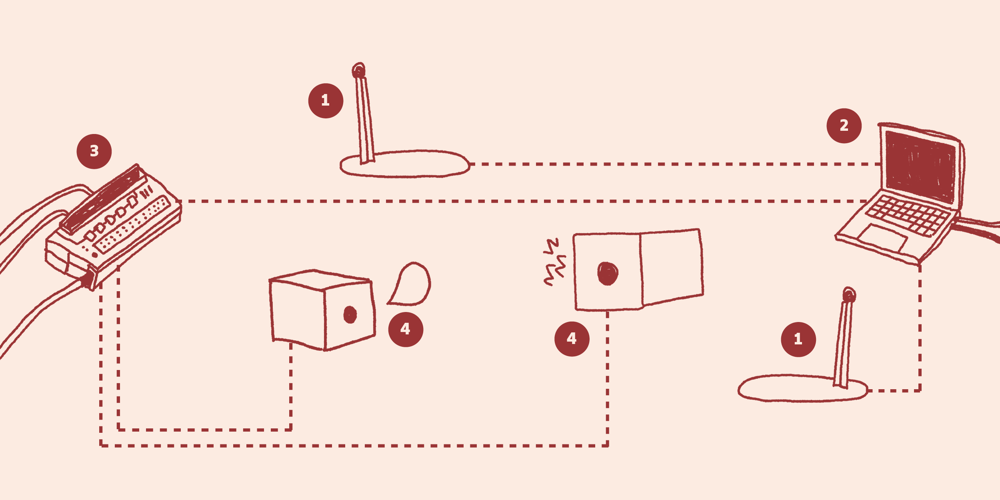
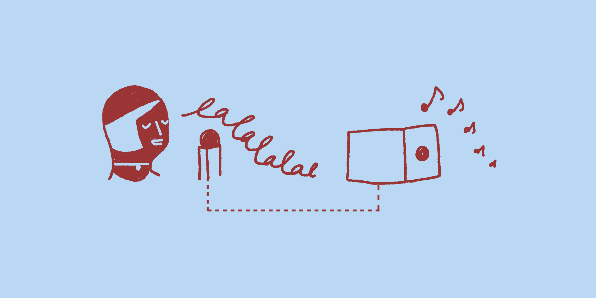
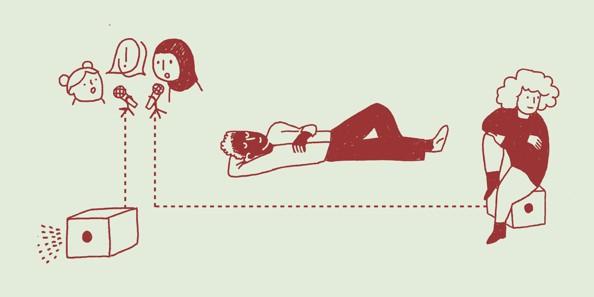

# VOIX SINGULIÈRES | EXPERIENCE COLLECTIVE

[Voix singulière, expérience collective](https://www.cite-sciences.fr/fr/au-programme/lieux-ressources/carrefour-numerique2/les-appels-a-projets-innovants/prototypes-et-experiences-sonores-laureats-2025/voix-singulieres-experience-collective) est une installation interactive et participative portée par l’équipe ISMM de l’Ircam, lauréate de l’[Appel à projets innovants Universcience 2025](https://www.universcience.fr/fr/professionnels/appel-a-projets-innovants-universcience/appel-a-projets-innovants-24-25), thématique « Prototypes et expériences sonores ». Cette page propose quelques éléments sur le contexte de recherche scientifique, technologique, et artistique dans lequel ce projet s'inscrit.

L’équipe Interaction, Son, Musique, Mouvement (ISMM - UMR STMS) de l’Ircam (Institut de recherche et coordination acoustique) développe de nouvelles pratiques musicales à l’aide de la technologie. L'installation s’inscrit dans deux axes de recherches : les **interactions musicales collectives** et l'**interaction avec des modèles de synthèse sonore**.

## Interactions musicales collectives

L'équipe ISMM conçoit des interactions musicales collectives basées sur des systèmes musicaux distribués (où différents appareils sont connectés).
 

Pour en savoir plus : [la page du projet ANR DOTS](https://www.ircam.fr/fr/recherche/projets/172).

## Interaction avec des modèles de synthèse sonore

Un autre champ de recherche de l'équipe est le design d’interaction avec des modèles de synthèse sonore pour créer de nouveau instruments logiciels pour la création musicale.

Le processus de recherche vise à développer des prototypes d’instruments interactifs avec des artistes experts en studio, à les mener jusqu’au concert, puis à en abstraire des boîtes à outils informatiques plus générales pouvant être prises en main par d’autres artistes.

<iframe width="560" height="315" src="https://www.youtube.com/embed/yXSNCLuCFCQ?si=tGXW-FqV87cJCxEE" title="YouTube video player" frameborder="0" allow="accelerometer; autoplay; clipboard-write; encrypted-media; gyroscope; picture-in-picture; web-share" referrerpolicy="strict-origin-when-cross-origin" allowfullscreen></iframe>

C’est par exemple le cas dans le concert **Electro-Odyssée Memoria** créé en février 2026 à l'Ircam avec Fabrizio Rat, Rémi Fox et Augustin Muller, où des systèmes interactifs réagissent en temps réel à la musique improvisée au piano ou au saxophone, selon des modalités préparées collectivement en amont, en studio, lors de répétitions.

Pour en savoir plus : [la page du projet ANR OpenTuning](https://www.ircam.fr/fr/recherche/projets/204).

## Conception de l'installation

La conception l'installation sonore à la Cité des sciences et de l'Industrie a participé au processus de recherche de l'équipe ISMM :

- **Sur le plan technologique**, en permettant d’expérimenter une association inédite de technologies issues de ces champs de recherche  
- **Sur le plan méthodologique**, en permettant de concevoir les interactions avec ces systèmes génératifs dans des [ateliers participatifs de co-conception](https://www.cite-sciences.fr/fr/au-programme/lieux-ressources/carrefour-numerique2/les-appels-a-projets-innovants/prototypes-et-experiences-sonores-laureats-2025) avec les publics et les équipes d’Universcience, plutôt que dans un studio avec des artistes experts.

Illustrations : Louise Viollet Duval.

